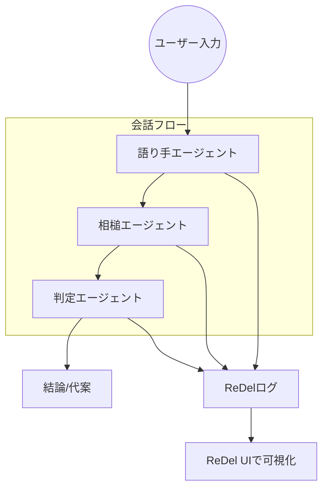

# 多エージェント対話システム 設計書

## 概要
このプロジェクトでは、ユーザーからの入力（テキストや写真）を元に、複数のローカルLLMエージェントが対話しながら結論を導くシステムを構築する。各エージェントは独自の役割を持ち、対話の流れを順番に制御し、最終的な判断を出す。AutoGenフレームワークの**Sequential Workflow**パターンにより、エージェントが定められた順序でメッセージを処理し、次のエージェントへ渡す【808714908829024†L115-L118】。対話の過程はReDelツールキットを使って記録し、Web UIで可視化・再生できる【75144017025218†L42-L48】。

## 目的
- **意思決定支援**: 複数エージェントが協調し、ユーザーの課題に対して多角的に議論し、説得力のある結論を提供する。
- **対話過程の可視化**: 各エージェントの発言や委譲行動を記録し、後からプロセスの分析や改善に役立てる。
- **拡張性と管理性**: エージェントのロールやツールを部品単位で設計し、後から容易に追加・変更できるようにする。

## 使用フレームワーク
- **AutoGen**: MicrosoftのOSSフレームワーク。複数エージェントが順序またはグループチャット形式で自然言語会話を行う設計を提供する。Sequential Workflowでは各エージェントが特定のタスクを実行し、次のエージェントへメッセージを渡す【808714908829024†L115-L118】。
- **ReDel**: 再帰的マルチエージェントシステムのためのツールキット。PythonライブラリとWeb UIから構成され、イベントベースのロギングと対話の再生機能を提供する【75144017025218†L42-L48】。一つのルートエージェントが複雑なタスクを子エージェントに分割・委譲する仕組みをサポート【75144017025218†L62-L67】。

## システム構成

### 流れの説明
1. **ユーザー入力**: テキストや写真を受け取り、前処理（画像からテキスト抽出等）を行う。
2. **語り手エージェント (A1)**: 大胆で自由な語り方で意見を提示し、ハルシネーションも許容する。
3. **相槌エージェント (A2)**: 語り手の発言を慎重に確認し、必要に応じて外部検索ツールで裏付けを取る。問題が無ければ同意し、問題があれば指摘する。
4. **判定エージェント (A3)**: 対話の進行を調整し、必要なタイミングで議論をまとめる。適切な時点で終了し、代案も提示する。
5. **ログ記録と可視化**: AutoGenで生成される各メッセージやイベントはReDelのロギング機能で記録され、Web UIで対話の再生・分析が可能となる【75144017025218†L42-L48】。

## エージェントロール定義
| エージェント | キーワード | 役割のポイント |
|---|---|---|
| 語り手 | 自由・大胆・ハルシネーション | 初期意見を創造的に提示し、議論の方向性を示す |
| 相槌役 | 慎重・裏付け・同意/指摘 | 語り手の主張を確認し、必要に応じて外部検索ツールで裏を取る |
| 判定役 | 調整・終了条件・代案 | 議論を整理し、適切な時点で終了と結論付けを行う。代替案を出す |

## 設計方針
- **モジュール性**: エージェントごとに独立したクラスやファイルでロール定義とプロンプトを管理し、再利用と拡張を容易にする。
- **シンプルな順序制御**: AutoGenのSequential Workflowを使用し、語り手→相槌役→判定役の順に処理を流す【808714908829024†L115-L118】。後の拡張で並列や再帰的な構造を導入できるように設計する。
- **ロギングと可視化**: ReDelでログ収集とUI可視化を標準化し、対話の質やボトルネックを分析できるようにする【75144017025218†L42-L48】。
- **環境依存性への対応**: Ubuntu 24.04 + GPU (A5000)環境で動作するよう、PythonとCUDAのバージョン管理、LLMモデルのローカル実行に対応する。
- **ユーザー体験**: 対話結果だけでなくプロセスを楽しめるように、キャラクターの個性を意識したプロンプトを用意する。

## 実装計画
1. **環境準備**
   - Python環境のセットアップ（venvまたはPoetry）。必要なパッケージ: `autogen`, `redel`, `playwright`など。
   - CUDAやGPUドライバを最新にし、モデル推論に利用する。

2. **エージェントの構築**
   - 語り手、相槌役、判定役のエージェントクラスを定義し、`system_message`や役割固有のプロンプトを設定する。
   - 相槌役の外部検索にはWeb検索ツール（後に拡張）を組み込む。

3. **ワークフロー設計**
   - AutoGenのSequential Workflowパターンを用い、ユーザーメッセージ→語り手→相槌役→判定役の順でメッセージを処理する構成を作る。
   - 終了条件やターン数の制御を追加し、判定役が適切なタイミングで対話を終了させるようにする。

4. **ロギングと可視化**
   - AutoGenで生成されるメッセージとイベントをReDelのログ機能に渡し、Web UIで再生できるよう設定する。
   - ログの保存先やセッションIDを管理し、複数の実験を比較しやすくする。

5. **テストと検証**
   - サンプルタスク（例：旅行計画、商品レビューなど）で対話を実行し、対話フローとロギングが正しく動作するか検証する。
   - パフォーマンスやメモリ消費を測定し、GPUの利用効率を確認する。

6. **拡張と調整**
   - エージェント数を増やした並列処理や再帰的委譲（ReDelの機能）の導入を検討。
   - ユーザーフィードバックを元にキャラクター設定やプロンプトを改善する。

## 期待される成果
- 各エージェントが定められた順序で協調し、ユーザーからのお題に対する多角的な議論と結論を提供する。
- ReDelで記録された対話ログを通して、エージェント間の挙動や委譲の流れを可視化でき、改善点を容易に特定できる【75144017025218†L42-L48】。
- システム全体がモジュール化されているため、新しいエージェントやツールの追加、他フレームワークとの連携がしやすい。
